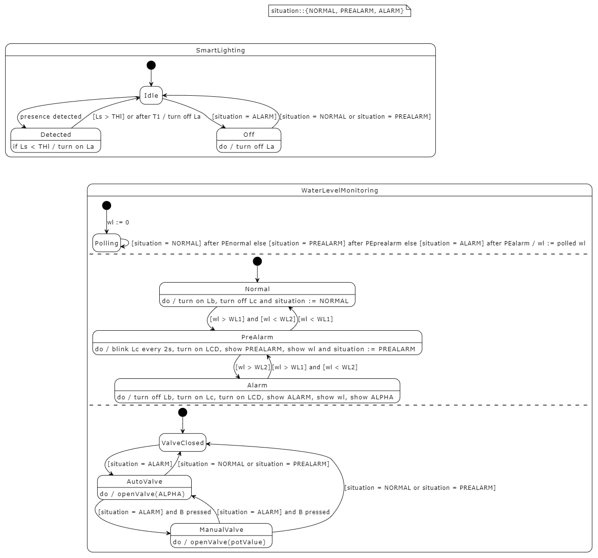
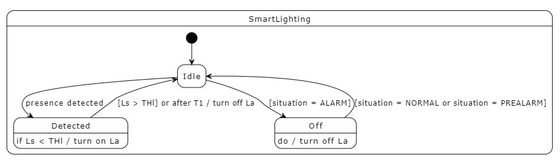

# 
 IOT Assignment #2 report

## 
 Smart Bridge

## Collaborators:
- Salvatore Antonio Addimando
- Benedetta Pacilli
- Valentina Pieri

# Index

# FSM schema

<figcaption align = "center">Figure 1 - FSM schema</figcaption>

In Figure 1 it is shown the schema representation of the Finite State Machine of the program.  We decided to structure the state diagram in two macro-states: the first corresponding to the Smart Lightning behavior and the latter to the Monitoring of the Water Level.  

## Smart Lighting

<figcaption align = "center">Figure 2 - Smart Lightning state diagram</figcaption>

The focus of the diagram in figure 2 is the division in three states: Idle, Detected and Off.
This parting can be observed in the code as well, inside the SmartLightningState.h file.  The following part aims to the description of how we implemented the smart lightning behavior functioning in the state diagram and foremost, how the states allow a correct conduct.  The initial state is Idle. Idle represent the state in which nothing was detected and the water level has been reported either as normal or pre-alarm. As soon as something has been detected by the Passive InfraRed sensor (PIR) the state changes to Detected. In the Detected state a light, the La led, can be turned on if the photo sensor measures a light level below a specified threshold, THl, and it can be turned off either if the light level goes beyond THl or a time, T1, has passed. T1 restarts whenever the PIR detects movement. There is another way the Idle state can be exited, when the water level is so high that the situation of the water monitoring is labeled as ALARM. In this case the state of the smart lightning is “Off”: the La led is always off which means that anything that is detected by the PIR is ignored. From the Off state, it is possible to return to the Idle state when the water level situation is labeled either as PRENORMAL or NORMAL.

## Water Level Monitoring

<figcaption align = "center">Figure 3 - Water Level Monitoring state diagram</figcaption>

Figure 3 shows how the monitoring behavior was modelled. The water level monitoring was conceptually split in three diagrams.  Firstly, the polling action was defined through its dedicated schema, thus showing how its functioning is loosely coupled with the rest and continuously goes on in the background. At the beginning, the water level is set to zero and later changed, according to the polling results. Water polling is done every PEnormal/PEprealarm/PEalarm seconds based on how high the water level is.  The central part of the image shows, through three states, what happens in each of the three possible situations: NORMAL, PREALARM and ALARM. The water level starts off as normal, in which case the Lb led, a green light, is turned on and the Lc led, a red light, is kept off. If the measured water level exceeds the WL1 threshold but not the WL2 one, the state changes to preAlarm. In this second case, Lb is still on, Lc starts blinking and a Liquid Crystal Display (LCD) is turned on so to warn on the current water level. In case the water level goes beyond the W2 threshold, the alarm state is entered, Lb goes off while Lc is fully turned on and the LCD shows, not only the water level, but also the opening degree of a valve which only opens in the alarm situation.  The third and final part of the diagram is a schema regarding the valve functioning.  Originally, the valve is closed and it is kept closed when the situation is either a normal or a preAlarm one. If there is an alarm situation, the valve is opened and it automatically and linearly opens according to the water level. While the valve is in automatic mode, its control can be taken using a button and a potentiometer; this way the opening can be ad large as desired.  Repressing the button allows returning to automatic mode. 

# Circuit schema

<figcaption align = "center">Figure 4 - Circuit graphic schema</figcaption>

<figcaption align = "center">Figure 5 - Circuit minimal schema</figcaption>

Figures 4 and 5 showcase the circuit designed used in the project.